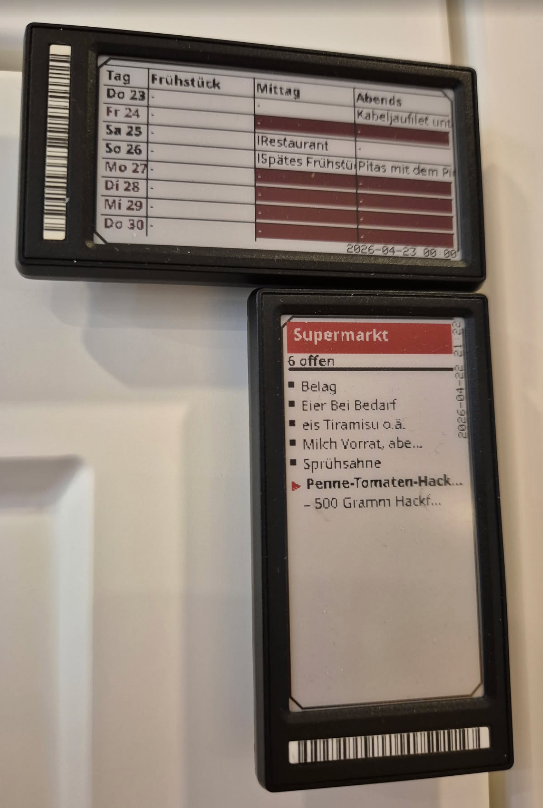

A .NET (C#) client library for **[OpenEPaperLink](https://github.com/OpenEPaperLink/OpenEPaperLink)** access points (APs) and tags.

This repo contains the reusable library plus a couple of sample apps that generate images/JSON for e-paper tags and publish them via an AP.

## Features

It supports:
* multiple APs
* roaming tags
* generate JPEG and publish it as static image
* generate JSON for image rendering on the AP

## Mealie sample

As one of the examples, it reads the mealplan and shopping list from a Mealie server and shows them on two tags.

